# Sommaire

1. [Prérequis technique](#1-prérequis-techniques)
2. [Configuration sur le serveur Debian (Debian 13)](#2-configuration-sur-le-serveur-debian-debian-13)
3. [Configuration sur le serveur Windows (Windows serveur 2022)](#3-configuration-sur-le-serveur-windows-windows-serveur-2022)
4. [Configuration sur le client Linux (Ubuntu 24.04 LTS)](#4-configuration-sur-le-client-linux-ubuntu-2404-lts)
5. [Configuration sur le client Windows (Windows 10)](#5-configuration-sur-le-client-windows-windows-10)
6. [FAQ](#6-faq)


# 1. Prérequis techniques  

## Architecture de l'Environnement Virtuel (PROXMOX)

### Configuration Réseau Globale

| Paramètre | Valeur |
| :--- | :--- |
| **Réseau** | `172.16.30.0/24` |
| **Masque de sous-réseau** | `255.255.255.0` |
| **Broadcast (Diffusion)** | `172.16.30.255` |
| **Passerelle (Gateway)** | `172.16.30.254`  |
| **Serveur DNS** | `8.8.8.8` |

## Inventaire des Machines Virtuelles

### Pôle Serveurs

| OS | Nom d'hôte | Adresse IP | Comptes Utilisateurs Requis |
| :--- | :--- | :--- | :--- |
| **Debian** | `srvlx01` | `172.16.30.10` | <ul><li>`root` (Administrateur système)</li><li>`wilder` (Utilisateur standard)</li></ul> |
| **Windows Server 2022** | `srvwin01` | `172.16.30.5` | <ul><li>`Administrator` (Administrateur local/domaine)</li><li>`wilder` (Utilisateur standard)</li></ul> |

### Pôle Clients

| OS | Nom d'hôte | Adresse IP | Comptes Utilisateurs Requis |
| :--- | :--- | :--- | :--- |
| **Linux** | `clilin01` | `172.16.30.30` | <ul><li>`wilder`</li></ul> |
| **Windows 10** | `cliwin01` | `172.16.30.20` | <ul><li>`wilder`</li></ul> |

# 2. Configuration sur le serveur Debian (Debian 13)

## 1. Configuration de l'interface réseau

**Allez voir votre configuration de carte réseau**

``` bash
ip adds show
```
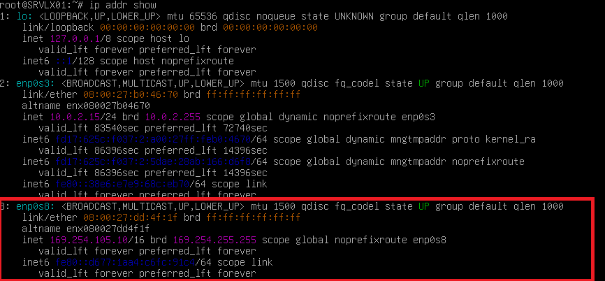.

Comme vous pouvez le voir l'adresse ip existante n'est pas celle souhaité.

**Ajoutez la nouvelle adresse ip a la carte réseau**

``` bash
ip addr add 172.16.30.10/24 dev enp0s8
```


**Si vous n'avez pas de carte réseau configuré ouvrez le fichier d'interface réseau**

``` bash
nano /etc/network/interface
```

**Une fois dans le fichier interface ajouter votre carte réseau ainsi que les informations souhaité**

``` bash
ip addr add 172.16.30.10/24 dev enp0s8
```

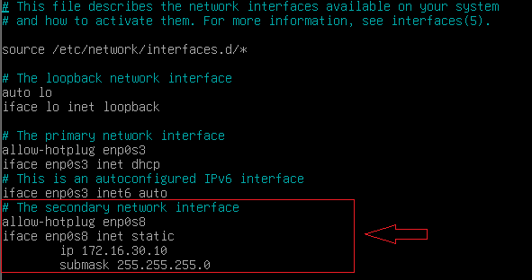

### Mettez a jour votre service de gestion reseau
**Pour ce faire vous pouvez soit : Relancer le service de gestion du reseau puis activer la configuration du réseau en deux commandes distinctes**
``` bash
systemctl restart networking.service
```
``` bash
ifup enp0s8
```
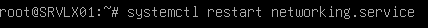  


**Soit faire les deux actions en une seule commande**(recommandé)

``` bash
systemctl restart networking.service;ifup enp0s8
```


**Verifier si votre carte réseau est désormais active, votre adresse IP et votre masque de sous-réseau sont bien configuré**
``` bash
ip addr show
```
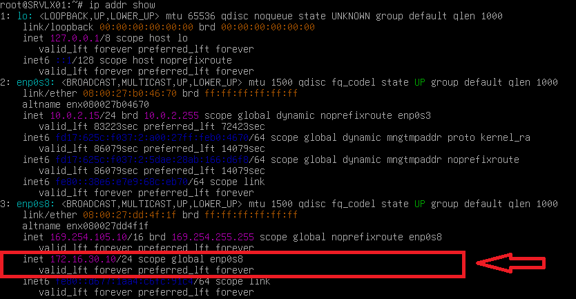

**Vous pouvez tester la configuration avec un ping vers une autre machine sur le meme réseau** (exemple avec la machine ubuntu préalablement configuré)

``` bash
ping -c 4 172.16.30.30
```
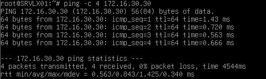  
**Et voila comme vous pouvez le constaté la création ainsi que la configuration de votre carte réseau est bien effectué !**


## 2. Installation du service OpenSSH

``` bash
sudo apt install openssh-server
```

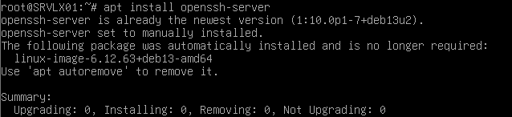

**Permet de configurer le service SSH pour qu'il démarre automatiquement chaque fois que le système d'exploitation est redémarré** 

``` bash
sudo systemctl enable ssh
```

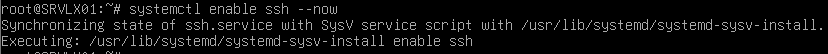

**Vérifier le status de la configuration ssh** 

``` bash
sudo systemctl status ssh
``` 

## 3. Configuration de l'interconnexion SSH avec le client windows

**Sur votre serveur debian - Générer une clé ssh**
``` bash
ssh-keygen -t ed25519
```
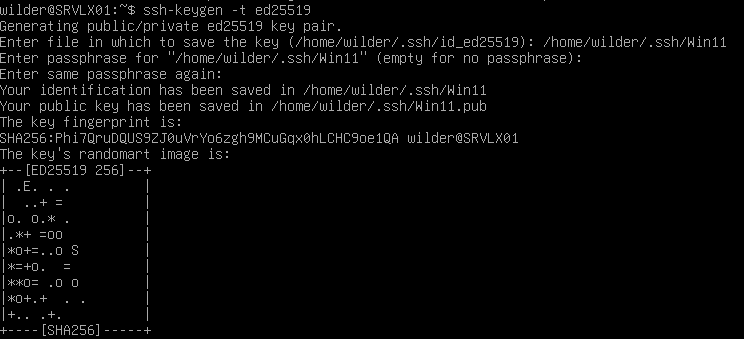

**Renseigner où et a quel nom seront les clés SSH**

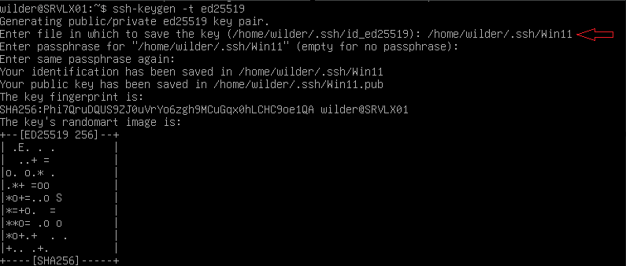

**Enfin renseigner le mot de passe que vous souhaiter créer pour cette paire de clé**

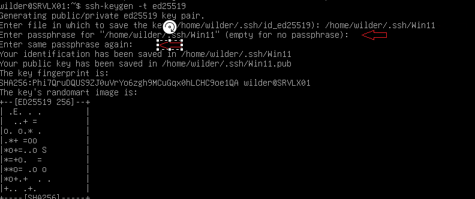

**Sur votre serveur debian - Il faudra copier la clé plublique vers Windows11**
``` bash
ssh-copy-id -i ~/.ssh/Win11.pub wilder@172.16.30.20
```
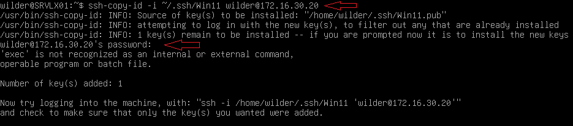  
Pour terminer la copie il vous sera demander de taper le mot de passe de votre utilisé pour vous connecter a votre compte windows (seconde flèche rouge).

**Sur Windows - Verifier que la clé est bien ajouté a votre fichier**
``` bash
``` bash
Get-Content C:\Users\wilder\.ssh\authorized_keys.txt
```
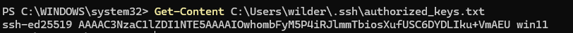 

**Pour finir tentative de connexion depuis le serveur Debian**
``` bash
ssh wilder@172.16.30.20
```
 

**Connexion a votre client Windows effectué**

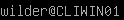

**Pour se deconnecter de la machine client Windows il vous suffit de taper exit**
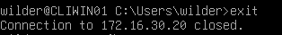

## 3. Configuration de l'interconnexion SSH avec le client ubuntu

**Créer une cle ssh pour la connection sécurisé pour executer le script depuis sa propre machine sur le serveur debian qui lui meme administre une machine client** 

``` bash
ssh-keygen 
```  
ou
``` bash
ssh-keygen -t ed25519
```


**Vous trouverez la clé publique à l’aide de cette commande** (.pub correspond a la clé public)  

``` bash
cat ~/.ssh/id_ed25519.pub
```


**Une fois la clé SSH crée, copiez la vers le serveur voulu avec ssh-copy-id** (confirmation de connexion) 

``` bash
ssh-copy-id -i ~/.ssh/id_ed25519.pub wilder@172.16.30.10
```

  
Comme vous pouvez le constater on vous pose une question avant de passer a la suite repondez yes si vous souhaité continuer la copie si les informations renseignés sont bonnes.

**Entrez le mot de passe de votre serveur Debian** 

``` bash
# wilder@172.16.30.10's password: "Votre mot de passe"
```

  

**Et voilà la clé publique est enregistrée sur votre machine client**


**Pour éviter de retaper votre passphrase à chaque connexion vous pouvez activer l’agent SSH sur le client avec ssh-add ~/votre_chemin puis entrez un mot de passe ou pas pour sécuriser votre connexion** 

``` bash
ssh-add ~/.ssh/id_ed25519
```


Et voilà l’interconnexion sécurisé via OpenSSH entre vos deux machines est desormais établie.

# 3. Configuration sur le serveur Windows (Windows serveur 2022)


# 4. Configuration sur le client Linux (Ubuntu 24.04 LTS)
## 1. Configuration de la carte réseau

## 2. Installation du service OpenSSH

**Installer le service OpenSSH**
``` bash
sudo apt install openssh-server
```


**Verifier si openssh est bien installer en tapant la commande suivante**  
``` bash
sudo systemctl status ssh
```

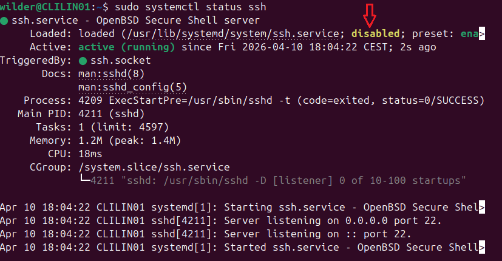  
Comme vous pouvez le voir le service ssh est bien installer mais il ne demarrera pas automatiquement a chaque demarrage de votre machine.

**Configuration du service SSH pour démarrage automatique** 

``` bash
sudo systemctl enable ssh
```

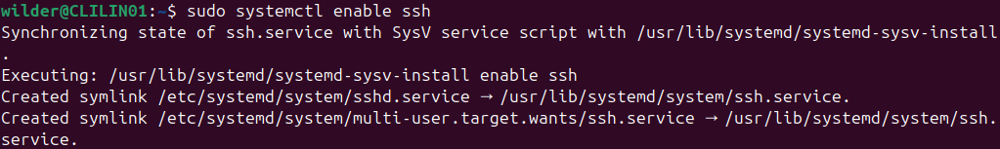

**Revérifier le status de la configuration ssh** 

``` bash
sudo systemctl status ssh
```

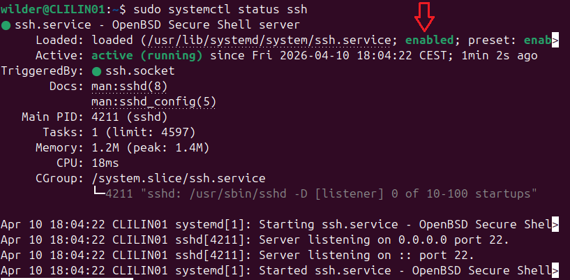  
Et voilà maintenant a chaque redemarrage de votre machine vous n'aurais pas a réactiver votre service ssh, il se lancera automatiquement.

Et voilà l’interconnexion sécurisé via OpenSSH entre vos deux machines est desormais établie. 

## 3. Configuration de l'interconnexion SSH avec le serveur Windows 

## 4. Logiciels et configurations complémentaires

### Logiciels

Pour le bon fonctionnement du menu connexion il est nécessaire d'installer sur le client Linux l'outil ipcalc avec la commande suivante :

```bash
sudo apt install ipcalc
```


# 5. Configuration sur le client windows (Windows 11)
## 1. Configuration de la carte réseau

## 2. Configuration de l'interconnexion SSH avec le serveur Linux Debian
#### Avant toute chose pensez a lancer PowerShell en administrateur (évite tout problème de droit)
**Installer le serveur OpenSSH**
``` powershell
Add-WindowsCapability -Online -Name OpenSSH.Server~~~~0.0.1.0
```
.

**Une fois l'installation lancé cette page va s'afficher veillez a bien attendre la fin du chargement c'est assez long.**
.

**Démarrer et activer au démarrage**

- Demarrage et Activation du service SSH au demarrage:
``` powershell
Start-Service sshd
```
``` powershell
Set-Service -Name sshd -StartupType Automatic
```
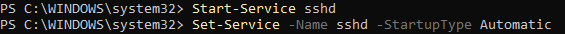.

**Consulter l'etat du service SSH**
``` powershell
Get-Service sshd
```
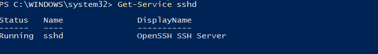.

**Ensuite il faut créer le fichier ou mes clés seront stockés**
``` powershell
New-Item -ItemType File -Path "C:\ProgramData\ssh\authorized_keys" -Force
```
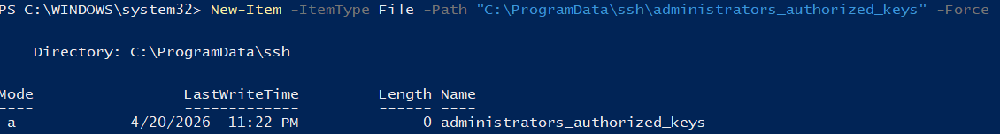

# 6. FAQ
