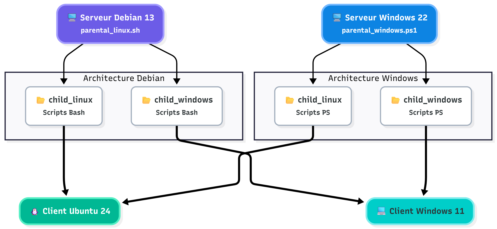

# **Projet 2 : The Scripting Project**
## Sommaire
- [1. Le projet](#1-le-projet)
- [2. Introduction et mise en contexte](#2-introduction-et-mise-en-contexte)
- [3. Membres et rôles du groupe de projet (Groupe 3)](#3-membres-et-rôles-du-groupe-de-projet-groupe-3)
- [4. Choix Techniques et Infrastructure](#4-choix-techniques-et-infrastructure)
  - [Serveurs d'administration](#serveurs-dadministration)
  - [Machines Clientes cibles](#machines-clientes-cibles)
- [5. Difficultés rencontrées](#5-difficultés-rencontrées)
- [6. Solutions trouvées](#6-solutions-trouvées)
- [7. Améliorations possibles](#7-améliorations-possibles)
---
## 1. Le projet

Ce projet consiste à créer un outil d'administration centralisée multi-plateforme. Il est composé de deux scripts principaux : l'un développé en Bash et l'autre en PowerShell. Ces scripts interagissent avec des machines distantes situées sur le même réseau.

**Objectifs finaux de l'outil :**
* Gérer des utilisateurs à distance (création, modification, etc.).
* Administrer des postes clients (redémarrage, gestion de répertoires, etc.).
* Interroger le statut des machines (IP, OS, espace disque, etc.).
* Créer et rechercher des informations dans des journaux d'événements (logs).
* Automatiser des opérations ciblées via une interface ergonomique (menus interactifs).

---
## 2. Introduction et mise en contexte

* Mise en place d'une architecture client/serveur hétérogène (Windows et Linux).
* Création et gestion experte de scripts Bash et PowerShell.
* Travail collaboratif utilisant la méthode Agile (Sprints, Daily) et gestion des versions via Git.
* Déploiement d'une infrastructure virtualisée sur un hyperviseur Proxmox.

---
## 3. Membres et rôles du groupe de projet (Groupe 3)
Notre équipe applique la méthode Scrum avec des rôles tournants à chaque sprint. Le Product Owner (PO) fait le lien avec le client/formateur, tandis que le Scrum Master (SM) garantit la bonne application de la méthode.

  
| Membre de l'équipe | Rôle Sprint 1 | Rôle Sprint 2 | Rôle Sprint 3 | Rôle Sprint 4 |
| :--- | :--- | :--- | :--- | :--- |
| **Alexandre** | Scrum Master | Product Owner | Technicien | Technicien |
| **Anass** | Product Owner | Technicien | Scrum Master | Technicien |
| **Camille** | Technicien | Technicien | Product Owner | Scrum Master |
| **Jeremy** | Technicien | Scrum Master | Technicien | Product Owner |

---

## 4. Choix Techniques et Infrastructure
Toutes nos machines virtuelles sont hébergées sur le nœud de travail Proxmox distant. Conformément à la nomenclature, l'ID de nos VM est compris dans la plage **301 à 398** et leur nom commence par le préfixe **G3-**.

L'infrastructure réseau du Groupe 3 repose sur le sous-réseau **172.16.30.0/24** avec un masque en `255.255.255.0` et un serveur DNS pointant sur `8.8.8.8`.

### Serveurs d'administration

  
| Rôle | Nom VM | OS | Langue | IP | Compte Admin | Mot de passe |
| :--- | :--- | :--- | :--- | :--- | :--- | :--- |
| **Serveur Linux** | `SRVLX01` | Debian 13 (CLI) | US | 172.16.30.10 | `root` / `wilder` (sudo) | Azerty1* |
| **Serveur Windows** | `SRVWIN01` | Win Server 2022 (GUI) | US | 172.16.30.5 | `Administrator` / `Wilder` (admin) | Azerty1* |

### Machines Clientes cibles
| Rôle | Nom VM | OS | Langue | IP | Compte Utilisateur | Mot de passe |
| :--- | :--- | :--- | :--- | :--- | :--- | :--- |
| **Client Linux** | `CLILIN01` | Ubuntu 24 LTS | FR | 172.16.30.30 | `wilder` (sudo) | Azerty1* |
| **Client Windows** | `CLIWIN01` | Windows 11 | FR | 172.16.30.20 | `Wilder` (admin local) | Azerty1* |

*Passerelle par défaut (@IP DG) : 172.16.30.254*

---
## 5. Difficultés rencontrées 

* **Connexion des machines entre elles en SSH**

* **Le blocage des commandes sudo pendant nos tests**

* **La saisie des mots de passe en boucle :** On devait retaper notre mot de passe à chaque nouvelle action, surtout pour administrer Windows depuis le serveur Debian.

* **Le manque d'harmonisation des scripts enfants :** Vu qu'on codait à plusieurs en même temps, on n'avait pas tous la même façon de nommer nos variables ou d'indenter le code, ce qui rendait la relecture difficile.

* **Manque de temps et mauvaise organisation pour la partie Powershell**

---
## 6. Solutions trouvées 

* **Élévation de privilèges ciblée :** Mise en place d'une règle `NOPASSWD` via `visudo` sur les postes clients.

* **Authentification par clés SSH :** Explication ??? Pas tout compris moi!

* **Relecture des scripts :** Un seul technicien dédié à la relecture, à l'harmonisation de tous les scripts.

---
## 7. Améliorations possibles

* **Centralisation du menu secondaire :** Rapatrier la fonction du menu de navigation directement dans le script parent et l'exporter vers les scripts enfants.

* **Finalisation des logs :** Intégrer la journalisation complète des sorties de scripts, une partie que nous n'avons pas eu le temps de terminer pendant ce projet.

* **Changement d'utilisateur sécurisé :** Mettre en place une méthode plus sécurisée pour gérer les changements de comptes utilisateurs pendant l'exécution de l'outil.

* **Création d'utilisateurs en masse :** Modifier le script pour qu'il puisse lire un fichier CSV et créer plusieurs dizaines de comptes en une seule fois.

* **Vérification réseau préventive :** Faire en sorte que le script lance un simple `ping` vers la cible avant de démarrer. Si elle ne répond pas, le script s'arrête tout de suite au lieu de charger dans le vide.

* **Un design global amélioré**

* **Script Powershell fonctionnel**

---
